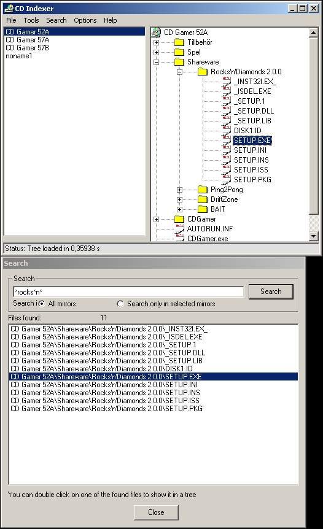



## CD Indexer v\. 1\.2\.3 beta

### Description

CD Indexer is a program in whish you can make mirrors of drives/CD's.

This program works just like Advantage Disk Catalog.

Why use this program? Is much faster!!!!!

This program is totaly FREEWARE, just like Drive Mirror 1.x and 2.x was.

For more help or info, go to the website: http://www.cdindexer.tk
 
### More Info
 

             |
---                |---
**Submitted On**   |2002-11-22 18:44:40
**By**             |[Tim H](https://github.com/Planet-Source-Code/PSCIndex/blob/master/ByAuthor/tim-h.md)
**Level**          |Advanced
**User Rating**    |5.0 (10 globes from 2 users)
**Compatibility**  |VB 6\.0
**Category**       |[Files/ File Controls/ Input/ Output](https://github.com/Planet-Source-Code/PSCIndex/blob/master/ByCategory/files-file-controls-input-output__1-3.md)
**World**          |[Visual Basic](https://github.com/Planet-Source-Code/PSCIndex/blob/master/ByWorld/visual-basic.md)
**Archive File**   |[CD\_Indexer15022511232002\.zip](https://github.com/Planet-Source-Code/tim-h-cd-indexer-v-1-2-3-beta__1-40985/archive/master.zip)

